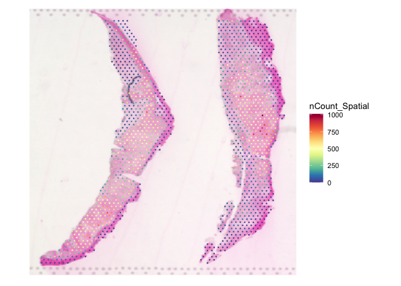
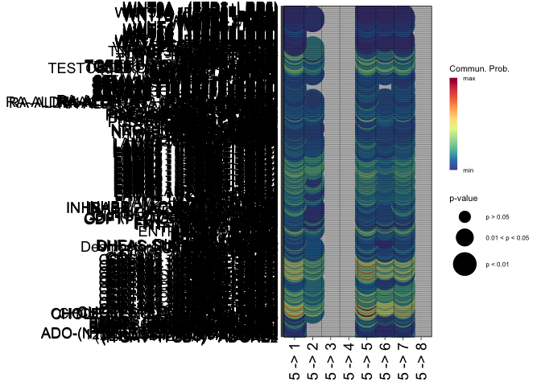
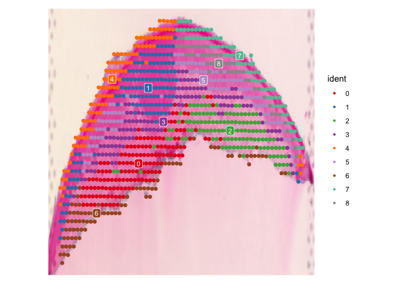

CellChat_Analysis
================
Sida Chen

# AK1

## Part I: Data input & processing and initialization of CellChat object

### Load single cell data from Cell Ranger output directory

``` r
ak1<- Load10X_Spatial(data_dir <- './data/ak1', 
                         filename = "filtered_feature_bc_matrix.h5")


plot1 <- VlnPlot(ak1, features = "nCount_Spatial", pt.size = 0.1) + NoLegend()
```

    ## Warning: Default search for "data" layer in "Spatial" assay yielded no results;
    ## utilizing "counts" layer instead.

``` r
plot2 <- SpatialFeaturePlot(ak1, features = "nCount_Spatial") + theme(legend.position = "right")
plot2
```

<!-- -->

### Data preprocessing: normalization

``` r
ak1 = ak1[,unname(which(colSums(GetAssayData(ak1))!=0))]
```

    ## Warning in GetAssayData.StdAssay(object = object[[assay]], layer = layer): data
    ## layer is not found and counts layer is used

    ## Warning: Not validating Centroids objects
    ## Not validating Centroids objects

    ## Warning: Not validating FOV objects
    ## Not validating FOV objects
    ## Not validating FOV objects
    ## Not validating FOV objects
    ## Not validating FOV objects
    ## Not validating FOV objects

    ## Warning: Not validating Seurat objects

``` r
ak1 <- SCTransform(ak1, assay = "Spatial", verbose = FALSE)
```

### Dimensionality reduction, clustering, and visualization

``` r
ak1 <- RunPCA(ak1, assay = "SCT", verbose = FALSE)
ak1 <- FindNeighbors(ak1, reduction = "pca", dims = 1:30)
```

    ## Computing nearest neighbor graph

    ## Computing SNN

``` r
ak1 <- FindClusters(ak1, verbose = FALSE)
ak1 <- RunUMAP(ak1, reduction = "pca", dims = 1:30)
```

    ## Warning: The default method for RunUMAP has changed from calling Python UMAP via reticulate to the R-native UWOT using the cosine metric
    ## To use Python UMAP via reticulate, set umap.method to 'umap-learn' and metric to 'correlation'
    ## This message will be shown once per session

    ## 16:07:56 UMAP embedding parameters a = 0.9922 b = 1.112

    ## 16:07:56 Read 1419 rows and found 30 numeric columns

    ## 16:07:56 Using Annoy for neighbor search, n_neighbors = 30

    ## 16:07:56 Building Annoy index with metric = cosine, n_trees = 50

    ## 0%   10   20   30   40   50   60   70   80   90   100%

    ## [----|----|----|----|----|----|----|----|----|----|

    ## **************************************************|
    ## 16:07:56 Writing NN index file to temp file /var/folders/nn/sjw17z350nbdmc7_r811zv4m0000gn/T//Rtmp1eyeo6/filefc4013eb1d48
    ## 16:07:56 Searching Annoy index using 1 thread, search_k = 3000
    ## 16:07:56 Annoy recall = 100%
    ## 16:07:56 Commencing smooth kNN distance calibration using 1 thread with target n_neighbors = 30
    ## 16:07:56 8 smooth knn distance failures
    ## 16:07:57 Initializing from normalized Laplacian + noise (using RSpectra)
    ## 16:07:57 Commencing optimization for 500 epochs, with 58354 positive edges
    ## 16:08:00 Optimization finished

``` r
color.use <- scPalette(nlevels(ak1)); names(color.use) <- levels(ak1)
Idents(ak1) <- factor(Idents(ak1), levels = levels(Idents(ak1)), labels = c("1", "2", "3", "4", "5", "6", "7"))
Seurat::SpatialDimPlot(ak1, label = T, label.size = 3, cols = color.use, pt.size.factor = 3)
```

    ## Scale for fill is already present.
    ## Adding another scale for fill, which will replace the existing scale.

<!-- -->

### Prepare input data for CelChat analysis

``` r
data.input1 = Seurat::GetAssayData(ak1, slot = "data", assay = "SCT")
```

    ## Warning: The `slot` argument of `GetAssayData()` is deprecated as of SeuratObject 5.0.0.
    ## ℹ Please use the `layer` argument instead.
    ## This warning is displayed once every 8 hours.
    ## Call `lifecycle::last_lifecycle_warnings()` to see where this warning was
    ## generated.

### define the meta data

``` r
meta1 = data.frame(labels = Seurat::Idents(ak1), slices = "slice1", row.names = names(Seurat::Idents(ak1))) # manually create a dataframe consisting of the cell labels
meta1$slices <- factor(meta1$slices)
unique(meta1$labels) # check the cell labels
```

    ## [1] 3 2 7 6 4 1 5
    ## Levels: 1 2 3 4 5 6 7

``` r
unique(meta1$slices)
```

    ## [1] slice1
    ## Levels: slice1

### load spatial transcriptomics information

``` r
spatial.locs1 = Seurat::GetTissueCoordinates(ak1, scale = NULL, cols = c("imagerow", "imagecol")) 
spatial.locs1 <- spatial.locs1[, !colnames(spatial.locs1) %in% "cell"]
```

### Scale factors of spatial coordinates

``` r
scalefactors1 = jsonlite::fromJSON('{"regist_target_img_scalef": 1.0, "tissue_hires_scalef": 0.6666667, "tissue_lowres_scalef": 0.2, "fiducial_diameter_fullres": 22.741010123623237, "spot_diameter_fullres": 15.160673415748823}')
spot.size = 65 # the theoretical spot size (um) in 10X Visium
conversion.factor1 = spot.size/scalefactors1$spot_diameter_fullres
spatial.factors1 = data.frame(ratio = conversion.factor1, tol = spot.size/2)
```

### Create a CellChat object

``` r
cellchat1 <- createCellChat(object = data.input1, meta = meta1, group.by = "labels",
                           datatype = "spatial", coordinates = spatial.locs1, spatial.factors = spatial.factors1)
```

    ## [1] "Create a CellChat object from a data matrix"
    ## Create a CellChat object from spatial transcriptomics data...

    ## Warning in createCellChat(object = data.input1, meta = meta1, group.by =
    ## "labels", : The 'meta' data does not have a column named `samples`. We now add
    ## this column and all cells are assumed to belong to `sample1`!

    ## Set cell identities for the new CellChat object 
    ## The cell groups used for CellChat analysis are  1, 2, 3, 4, 5, 6, 7

### Set the ligand-receptor interaction database

``` r
CellChatDB <- CellChatDB.human
showDatabaseCategory(CellChatDB)
```

<!-- -->

``` r
cellchat1@DB <- CellChatDB
```

### Preprocessing the expression data for cell-cell communication analysis

``` r
cellchat1 <- subsetData(cellchat1)
future::plan("multisession", workers = 4) 
cellchat1 <- identifyOverExpressedGenes(cellchat1)
cellchat1 <- identifyOverExpressedInteractions(cellchat1)
```

    ## The number of highly variable ligand-receptor pairs used for signaling inference is 336

``` r
execution.time = Sys.time() - ptm
print(as.numeric(execution.time, units = "secs"))
```

    ## [1] 47.69012

## Part II: Inference of cell-cell communication network

``` r
ptm = Sys.time()

cellchat1 <- computeCommunProb(cellchat1, type = "truncatedMean", trim = 0.1, 
                              distance.use = TRUE, interaction.range = 250, scale.distance = 0.01,
                              contact.dependent = TRUE, contact.range = 100)
```

    ## truncatedMean is used for calculating the average gene expression per cell group. 
    ## [1] ">>> Run CellChat on spatial transcriptomics data using distances as constraints of the computed communication probability <<< [2025-01-25 16:08:28.657664]"
    ## The input L-R pairs have both secreted signaling and contact-dependent signaling. Run CellChat in a contact-dependent manner for `Cell-Cell Contact` signaling, and in a diffusion manner based on the `interaction.range` for other L-R pairs. 
    ## [1] ">>> CellChat inference is done. Parameter values are stored in `object@options$parameter` <<< [2025-01-25 16:08:48.88682]"

### Filter out the cell-cell communication if there are only few number of cells in certain cell groups

``` r
cellchat1 <- filterCommunication(cellchat1, min.cells = 10)
```

### Extract the inferred cellular communication network as a data frame

``` r
df.net1 <- subsetCommunication(cellchat1)
```

### Infer the cell-cell communication at a signaling pathway level

``` r
cellchat1 <- computeCommunProbPathway(cellchat1)
```

### Calculate the aggregated cell-cell communication network

``` r
cellchat1 <- aggregateNet(cellchat1)

execution.time = Sys.time() - ptm
print(as.numeric(execution.time, units = "secs"))
```

    ## [1] 23.02346

``` r
ptm = Sys.time()

groupSize <- as.numeric(table(cellchat1@idents))
par(mfrow = c(1,2), xpd=TRUE)
netVisual_circle(cellchat1@net$count, vertex.weight = rowSums(cellchat1@net$count), weight.scale = T, label.edge= F, title.name = "Number of interactions")
netVisual_circle(cellchat1@net$weight, vertex.weight = rowSums(cellchat1@net$weight), weight.scale = T, label.edge= F, title.name = "Interaction weights/strength")
```

<!-- -->

``` r
netVisual_heatmap(cellchat1, measure = "count", color.heatmap = "Blues")
```

    ## Do heatmap based on a single object

<!-- -->

``` r
netVisual_heatmap(cellchat1, measure = "weight", color.heatmap = "Blues")
```

    ## Do heatmap based on a single object

<!-- -->

``` r
# sub-dataset
df.net_c12 <- subsetCommunication(cellchat1, sources.use = "2", targets.use = "1") ##gives the inferred cell-cell communications sending from cell groups 2 (dermis) to cell groups 1 (dysplastic).
df.net_c21 <- subsetCommunication(cellchat1, sources.use = "1", targets.use = "2") ##gives the inferred cell-cell communications sending from cell groups 1 (dysplastic) to cell groups 2 (dermis).
```

## Visualize cell-cell communication mediated by multiple ligand-receptors or signaling pathways

### Bubble plot

1)  show all the significant interactions (L-R pairs) from some cell
    groups (defined by ‘sources.use’) to other cell groups (defined by
    ‘targets.use’)

``` r
par(mfrow=c(1,1))
netVisual_bubble(cellchat1, sources.use = "2", targets.use = c("1":"6"), remove.isolate = FALSE, dot.size.min = 5, dot.size.max = 10, font.size = 17, grid.on = TRUE, color.grid = "black")
```

    ## Comparing communications on a single object

<!-- -->

``` r
netVisual_bubble(cellchat1, sources.use = "1", targets.use = c("1":"6"), remove.isolate = FALSE, dot.size.min = 5, dot.size.max = 10, font.size = 17, grid.on = TRUE, color.grid = "black")
```

    ## Comparing communications on a single object

<!-- -->

# AK2

## Part I: Data input & processing and initialization of CellChat object

### Load single cell data from Cell Ranger output directory

``` r
ak2<- Load10X_Spatial(data_dir <- './data/ak2', 
                         filename = "filtered_feature_bc_matrix.h5")


plot3 <- VlnPlot(ak2, features = "nCount_Spatial", pt.size = 0.1) + NoLegend()
plot4 <- SpatialFeaturePlot(ak2, features = "nCount_Spatial") + theme(legend.position = "right")
plot4
```

<!-- -->

### Data preprocessing: normalization

``` r
options(future.globals.maxSize = 4 * 1024 * 1024 * 1024) # Set to 4 GiB


ak2 = ak2[,unname(which(colSums(GetAssayData(ak2))!=0))]

ak2 <- SCTransform(ak2, assay = "Spatial", verbose = FALSE)
```

### Dimensionality reduction, clustering, and visualization

``` r
ak2 <- RunPCA(ak2, assay = "SCT", verbose = FALSE)
ak2 <- FindNeighbors(ak2, reduction = "pca", dims = 1:30)
```

    ## Computing nearest neighbor graph

    ## Computing SNN

``` r
ak2 <- FindClusters(ak2, verbose = FALSE)
ak2 <- RunUMAP(ak2, reduction = "pca", dims = 1:30)
```

    ## 16:10:18 UMAP embedding parameters a = 0.9922 b = 1.112

    ## 16:10:18 Read 1505 rows and found 30 numeric columns

    ## 16:10:18 Using Annoy for neighbor search, n_neighbors = 30

    ## 16:10:18 Building Annoy index with metric = cosine, n_trees = 50

    ## 0%   10   20   30   40   50   60   70   80   90   100%

    ## [----|----|----|----|----|----|----|----|----|----|

    ## **************************************************|
    ## 16:10:18 Writing NN index file to temp file /var/folders/nn/sjw17z350nbdmc7_r811zv4m0000gn/T//Rtmp1eyeo6/filefc40c911ebd
    ## 16:10:18 Searching Annoy index using 4 threads, search_k = 3000
    ## 16:10:19 Annoy recall = 100%
    ## 16:10:19 Commencing smooth kNN distance calibration using 4 threads with target n_neighbors = 30
    ## 16:10:21 Initializing from normalized Laplacian + noise (using RSpectra)
    ## 16:10:21 Commencing optimization for 500 epochs, with 60394 positive edges
    ## 16:10:25 Optimization finished

``` r
color.use <- scPalette(nlevels(ak2)); names(color.use) <- levels(ak2)
Idents(ak2) <- factor(Idents(ak2), levels = levels(Idents(ak2)), labels = c("1", "2", "3", "4", "5", "6", "7", "8"))
Seurat::SpatialDimPlot(ak2, label = T, label.size = 3, cols = color.use, pt.size.factor = 3)
```

    ## Scale for fill is already present.
    ## Adding another scale for fill, which will replace the existing scale.

<!-- -->

### Prepare input data for CelChat analysis

``` r
data.input2 = Seurat::GetAssayData(ak2, slot = "data", assay = "SCT")
```

### define the meta data

``` r
meta2 = data.frame(labels = Seurat::Idents(ak2), slices = "slice1", row.names = names(Seurat::Idents(ak2))) # manually create a dataframe consisting of the cell labels
meta2$slices <- factor(meta2$slices)
unique(meta2$labels) # check the cell labels
```

    ## [1] 5 6 3 1 8 2 4 7
    ## Levels: 1 2 3 4 5 6 7 8

``` r
unique(meta2$slices)
```

    ## [1] slice1
    ## Levels: slice1

### load spatial transcriptomics information

``` r
spatial.locs2 = Seurat::GetTissueCoordinates(ak2, scale = NULL, cols = c("imagerow", "imagecol")) 
spatial.locs2 <- spatial.locs2[, !colnames(spatial.locs2) %in% "cell"]
```

### Scale factors of spatial coordinates

``` r
scalefactors2 = jsonlite::fromJSON('{"regist_target_img_scalef": 1.0, "tissue_hires_scalef": 0.6666667, "tissue_lowres_scalef": 0.2, "fiducial_diameter_fullres": 22.741010123623237, "spot_diameter_fullres": 15.160673415748823}')
spot.size = 65 # the theoretical spot size (um) in 10X Visium
conversion.factor2 = spot.size/scalefactors2$spot_diameter_fullres
spatial.factors2 = data.frame(ratio = conversion.factor2, tol = spot.size/2)
```

### Create a CellChat object

``` r
cellchat2 <- createCellChat(object = data.input2, meta = meta2, group.by = "labels",
                           datatype = "spatial", coordinates = spatial.locs2, spatial.factors = spatial.factors2)
```

    ## [1] "Create a CellChat object from a data matrix"
    ## Create a CellChat object from spatial transcriptomics data... 
    ## Set cell identities for the new CellChat object 
    ## The cell groups used for CellChat analysis are  1, 2, 3, 4, 5, 6, 7, 8

### Set the ligand-receptor interaction database

``` r
CellChatDB <- CellChatDB.human
showDatabaseCategory(CellChatDB)
```

<!-- -->

``` r
cellchat2@DB <- CellChatDB
```

### Preprocessing the expression data for cell-cell communication analysis

``` r
cellchat2 <- subsetData(cellchat2)
future::plan("multisession", workers = 4) 
cellchat2 <- identifyOverExpressedGenes(cellchat2)
cellchat2 <- identifyOverExpressedInteractions(cellchat2)
```

    ## The number of highly variable ligand-receptor pairs used for signaling inference is 2219

``` r
execution.time = Sys.time() - ptm
print(as.numeric(execution.time, units = "secs"))
```

    ## [1] 138.9459

## Part II: Inference of cell-cell communication network

``` r
ptm = Sys.time()

cellchat2 <- computeCommunProb(cellchat2, type = "truncatedMean", trim = 0.1, 
                              distance.use = TRUE, interaction.range = 250, scale.distance = 0.01,
                              contact.dependent = TRUE, contact.range = 100)
```

    ## truncatedMean is used for calculating the average gene expression per cell group. 
    ## [1] ">>> Run CellChat on spatial transcriptomics data using distances as constraints of the computed communication probability <<< [2025-01-25 16:11:14.354938]"
    ## The input L-R pairs have both secreted signaling and contact-dependent signaling. Run CellChat in a contact-dependent manner for `Cell-Cell Contact` signaling, and in a diffusion manner based on the `interaction.range` for other L-R pairs. 
    ## [1] ">>> CellChat inference is done. Parameter values are stored in `object@options$parameter` <<< [2025-01-25 18:09:02.189342]"

### Filter out the cell-cell communication if there are only few number of cells in certain cell groups

``` r
cellchat2 <- filterCommunication(cellchat2, min.cells = 10)
```

### Extract the inferred cellular communication network as a data frame

``` r
df.net2 <- subsetCommunication(cellchat2)
```

### Infer the cell-cell communication at a signaling pathway level

``` r
cellchat2 <- computeCommunProbPathway(cellchat2)
```

### Calculate the aggregated cell-cell communication network

``` r
cellchat2 <- aggregateNet(cellchat2)

execution.time = Sys.time() - ptm
print(as.numeric(execution.time, units = "secs"))
```

    ## [1] 7074.494

``` r
ptm = Sys.time()

groupSize <- as.numeric(table(cellchat2@idents))
par(mfrow = c(1,2), xpd=TRUE)
netVisual_circle(cellchat2@net$count, vertex.weight = rowSums(cellchat2@net$count), weight.scale = T, label.edge= F, title.name = "Number of interactions")
netVisual_circle(cellchat2@net$weight, vertex.weight = rowSums(cellchat2@net$weight), weight.scale = T, label.edge= F, title.name = "Interaction weights/strength")
```

<!-- -->

``` r
netVisual_heatmap(cellchat2, measure = "count", color.heatmap = "Blues")
```

    ## Do heatmap based on a single object

<!-- -->

``` r
netVisual_heatmap(cellchat2, measure = "weight", color.heatmap = "Blues")
```

    ## Do heatmap based on a single object

<!-- -->

``` r
# sub-dataset
df.net_c51 <- subsetCommunication(cellchat2, sources.use = "5", targets.use = "1") ##gives the inferred cell-cell communications sending from cell groups 5 (dermis) to cell groups 1 (dysplastic).
df.net_c15 <- subsetCommunication(cellchat2, sources.use = "1", targets.use = "5") ##gives the inferred cell-cell communications sending from cell groups 1 (dysplastic) to cell groups 5 (dermis).
```

## Visualize cell-cell communication mediated by multiple ligand-receptors or signaling pathways

### Bubble plot

1)  show all the significant interactions (L-R pairs) from some cell
    groups (defined by ‘sources.use’) to other cell groups (defined by
    ‘targets.use’)

``` r
par(mfrow=c(1,1))
netVisual_bubble(cellchat2, sources.use = "5", targets.use = c("1":"8"), remove.isolate = FALSE, dot.size.min = 5, dot.size.max = 10, font.size = 17, grid.on = TRUE, color.grid = "black")
```

    ## Comparing communications on a single object

<!-- -->

``` r
netVisual_bubble(cellchat2, sources.use = "1", targets.use = c("1":"8"), remove.isolate = FALSE, dot.size.min = 5, dot.size.max = 10, font.size = 17, grid.on = TRUE, color.grid = "black")
```

    ## Comparing communications on a single object

<!-- -->

# AK4 lower part

## Part I: Data input & processing and initialization of CellChat object

### Load single cell data from Cell Ranger output directory

``` r
ak4_d<- Load10X_Spatial(data_dir <- './data/ak4', 
                         filename = "filtered_feature_bc_matrix.h5",
  assay = "Spatial")

plot5 <- VlnPlot(ak4_d, features = "nCount_Spatial", pt.size = 0.1) + NoLegend()
plot6 <- SpatialFeaturePlot(ak4_d, features = "nCount_Spatial") + theme(legend.position = "right")
plot6
```

<!-- -->

### Data preprocessing: normalization

``` r
ak4_d = ak4_d[,unname(which(colSums(GetAssayData(ak4_d))!=0))]

ak4_d <- SCTransform(ak4_d, assay = "Spatial", verbose = FALSE)
```

### Dimensionality reduction, clustering, and visualization

``` r
ak4_d <- RunPCA(ak4_d, assay = "SCT", verbose = FALSE)
ak4_d <- FindNeighbors(ak4_d, reduction = "pca", dims = 1:30)
```

    ## Computing nearest neighbor graph

    ## Computing SNN

``` r
ak4_d <- FindClusters(ak4_d, verbose = FALSE)
ak4_d <- RunUMAP(ak4_d, reduction = "pca", dims = 1:30)
```

    ## 18:09:52 UMAP embedding parameters a = 0.9922 b = 1.112

    ## 18:09:52 Read 921 rows and found 30 numeric columns

    ## 18:09:52 Using Annoy for neighbor search, n_neighbors = 30

    ## 18:09:52 Building Annoy index with metric = cosine, n_trees = 50

    ## 0%   10   20   30   40   50   60   70   80   90   100%

    ## [----|----|----|----|----|----|----|----|----|----|

    ## **************************************************|
    ## 18:09:52 Writing NN index file to temp file /var/folders/nn/sjw17z350nbdmc7_r811zv4m0000gn/T//Rtmp1eyeo6/filefc4050cd95fb
    ## 18:09:52 Searching Annoy index using 4 threads, search_k = 3000
    ## 18:09:52 Annoy recall = 100%
    ## 18:09:52 Commencing smooth kNN distance calibration using 4 threads with target n_neighbors = 30
    ## 18:09:53 Initializing from normalized Laplacian + noise (using RSpectra)
    ## 18:09:53 Commencing optimization for 500 epochs, with 34326 positive edges
    ## 18:09:55 Optimization finished

``` r
custom_colors <- c("#E41A1C", "#377EB8", "#4DAF4A", "#984EA3", "#FF7F00", "#BC9DCC", "#A65628", "#66C2A5", "#999999"); names(custom_colors) <- levels(ak4_d)

Seurat::SpatialDimPlot(ak4_d, pt.size.factor = 4, label = T, label.size = 3, cols = custom_colors)
```

    ## Scale for fill is already present.
    ## Adding another scale for fill, which will replace the existing scale.

<!-- -->

### Prepare input data for CelChat analysis

``` r
data.input4d = Seurat::GetAssayData(ak4_d, slot = "data", assay = "SCT")
```

### define the meta data

``` r
meta4d = data.frame(labels = Seurat::Idents(ak4_d), slices = "slice1", row.names = names(Seurat::Idents(ak4_d))) # manually create a dataframe consisting of the cell labels
meta4d$slices <- factor(meta4d$slices)
unique(meta4d$labels) # check the cell labels
```

    ## [1] 8 6 1 3 2 5 0 4 7
    ## Levels: 0 1 2 3 4 5 6 7 8

``` r
unique(meta4d$slices)
```

    ## [1] slice1
    ## Levels: slice1

### load spatial transcriptomics information

``` r
spatial.locs4d = Seurat::GetTissueCoordinates(ak4_d, scale = NULL, cols = c("imagerow", "imagecol")) 
spatial.locs4d <- spatial.locs4d[, !colnames(spatial.locs4d) %in% "cell"]
```

### Scale factors of spatial coordinates

``` r
scalefactors4d = jsonlite::fromJSON('{"regist_target_img_scalef": 1.0, "tissue_hires_scalef": 0.6666667, "tissue_lowres_scalef": 0.2, "fiducial_diameter_fullres": 22.766434, "spot_diameter_fullres": 15.177623}')
spot.size = 65 # the theoretical spot size (um) in 10X Visium
conversion.factor4d = spot.size/scalefactors4d$spot_diameter_fullres
spatial.factors4d = data.frame(ratio = conversion.factor4d, tol = spot.size/2)

d.spatial <- computeCellDistance(coordinates = spatial.locs4d, ratio = spatial.factors4d$ratio, tol = spatial.factors4d$tol)
min(d.spatial[d.spatial!=0])
```

    ## [1] 88.18455

### Create a CellChat object

``` r
levels(meta4d$labels)[levels(meta4d$labels)=='0'] <- "9"
cellchat4d <- createCellChat(object = data.input4d, meta = meta4d, group.by = "labels",
                           datatype = "spatial", coordinates = spatial.locs4d, spatial.factors = spatial.factors4d)
```

    ## [1] "Create a CellChat object from a data matrix"
    ## Create a CellChat object from spatial transcriptomics data... 
    ## Set cell identities for the new CellChat object 
    ## The cell groups used for CellChat analysis are  9, 1, 2, 3, 4, 5, 6, 7, 8

### Set the ligand-receptor interaction database

``` r
CellChatDB <- CellChatDB.human
showDatabaseCategory(CellChatDB)
```

<!-- -->

``` r
cellchat4d@DB <- CellChatDB
```

### Preprocessing the expression data for cell-cell communication analysis

``` r
cellchat4d <- subsetData(cellchat4d)
future::plan("multisession", workers = 4) 
cellchat4d <- identifyOverExpressedGenes(cellchat4d)
cellchat4d <- identifyOverExpressedInteractions(cellchat4d)
```

    ## The number of highly variable ligand-receptor pairs used for signaling inference is 2115

``` r
execution.time = Sys.time() - ptm
print(as.numeric(execution.time, units = "secs"))
```

    ## [1] 79.64143

## Part II: Inference of cell-cell communication network

``` r
ptm = Sys.time()

cellchat4d <- computeCommunProb(cellchat4d, type = "truncatedMean", trim = 0.1, 
                              distance.use = TRUE, interaction.range = 250, scale.distance = 0.01,
                              contact.dependent = TRUE, contact.range = 100)
```

    ## truncatedMean is used for calculating the average gene expression per cell group. 
    ## [1] ">>> Run CellChat on spatial transcriptomics data using distances as constraints of the computed communication probability <<< [2025-01-25 18:10:25.641705]"
    ## The input L-R pairs have both secreted signaling and contact-dependent signaling. Run CellChat in a contact-dependent manner for `Cell-Cell Contact` signaling, and in a diffusion manner based on the `interaction.range` for other L-R pairs. 
    ## [1] ">>> CellChat inference is done. Parameter values are stored in `object@options$parameter` <<< [2025-01-25 19:45:26.720944]"

### Filter out the cell-cell communication if there are only few number of cells in certain cell groups

``` r
cellchat4d <- filterCommunication(cellchat4d, min.cells = 10)
```

### Extract the inferred cellular communication network as a data frame

``` r
df.net4d <- subsetCommunication(cellchat4d)
```

### Infer the cell-cell communication at a signaling pathway level

``` r
cellchat4d <- computeCommunProbPathway(cellchat4d)
```

### Calculate the aggregated cell-cell communication network

``` r
cellchat4d <- aggregateNet(cellchat4d)

execution.time = Sys.time() - ptm
print(as.numeric(execution.time, units = "secs"))
```

    ## [1] 5704.99

``` r
ptm = Sys.time()

groupSize4d <- as.numeric(table(cellchat4d@idents))
par(mfrow = c(1,2), xpd=TRUE)
netVisual_circle(cellchat4d@net$count, vertex.weight = rowSums(cellchat4d@net$count), weight.scale = T, label.edge= F, title.name = "Number of interactions")
netVisual_circle(cellchat4d@net$weight, vertex.weight = rowSums(cellchat4d@net$weight), weight.scale = T, label.edge= F, title.name = "Interaction weights/strength")
```

<!-- -->

``` r
netVisual_heatmap(cellchat4d, measure = "count", color.heatmap = "Blues")
```

    ## Do heatmap based on a single object

<!-- -->

``` r
netVisual_heatmap(cellchat4d, measure = "weight", color.heatmap = "Blues")
```

    ## Do heatmap based on a single object

<!-- -->

``` r
# sub-dataset
df.net4d_35 <- subsetCommunication(cellchat4d, sources.use = "3", targets.use = "5") ##gives the inferred cell-cell communications sending from cell groups 3 (upper dermis) to cell groups 5 (dysplastic epidermis).
df.net4d_53 <- subsetCommunication(cellchat4d, sources.use = "5", targets.use = "3") ##gives the inferred cell-cell communications sending from cell groups 5 to cell groups 3.
```

## Visualize cell-cell communication mediated by multiple ligand-receptors or signaling pathways

### Bubble plot

1)  show all the significant interactions (L-R pairs) from some cell
    groups (defined by ‘sources.use’) to other cell groups (defined by
    ‘targets.use’)

``` r
par(mfrow=c(1,1))
netVisual_bubble(cellchat4d, sources.use = "3", targets.use = c("1":"9"), remove.isolate = FALSE)
```

    ## Comparing communications on a single object

<!-- -->

``` r
netVisual_bubble(cellchat4d, sources.use = "5", targets.use = c("1":"9"), remove.isolate = FALSE)
```

    ## Comparing communications on a single object

<!-- -->
